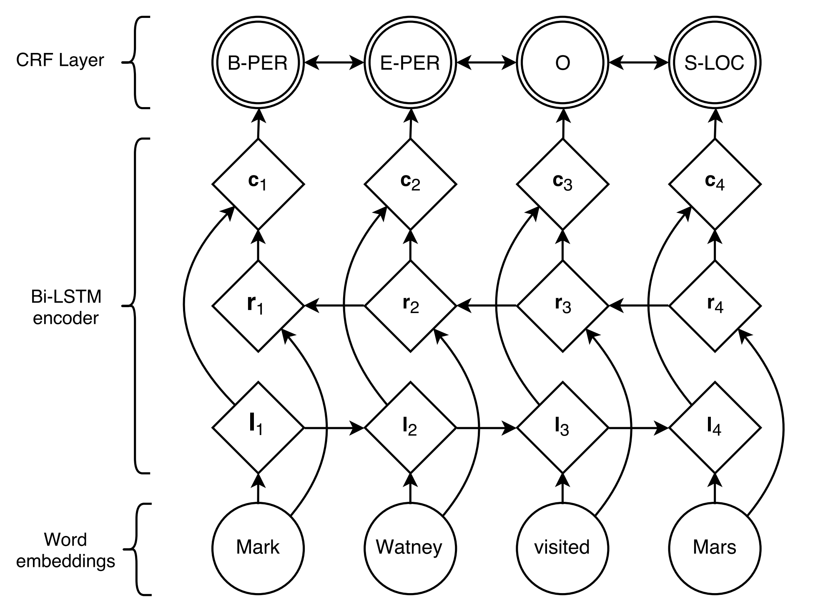
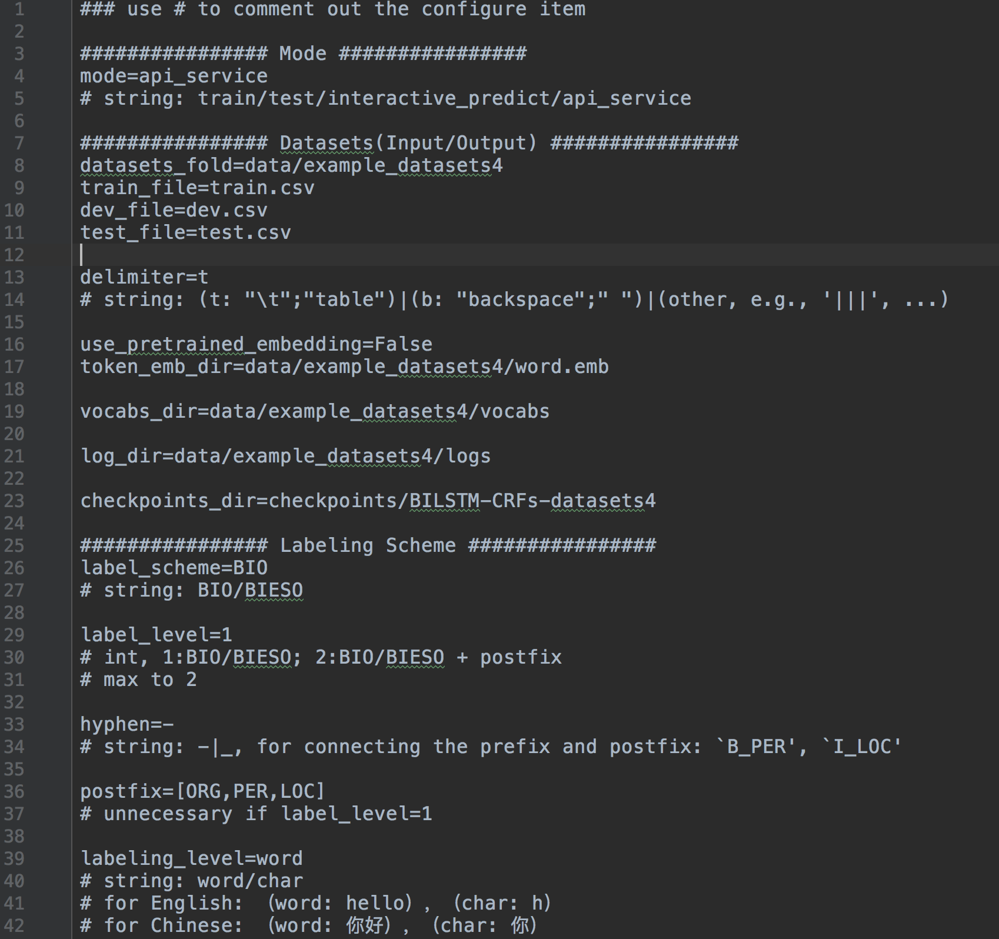
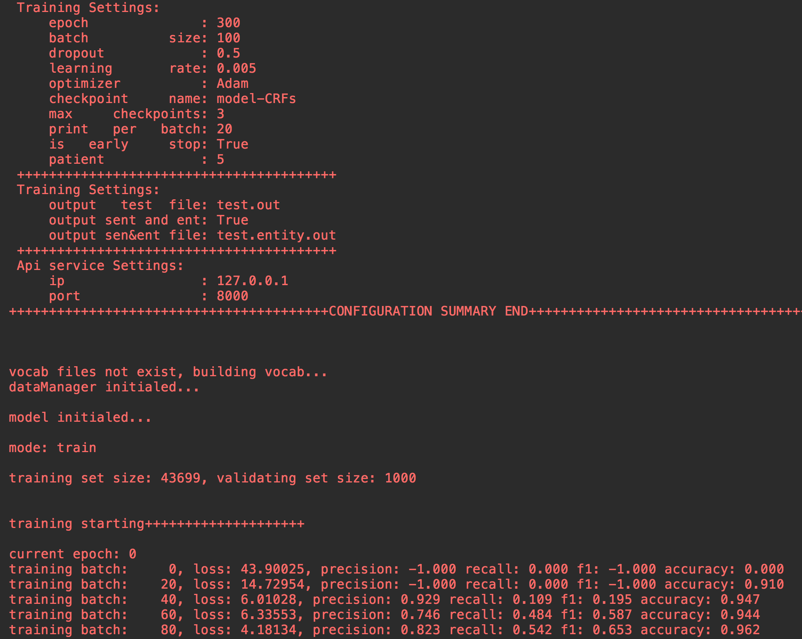
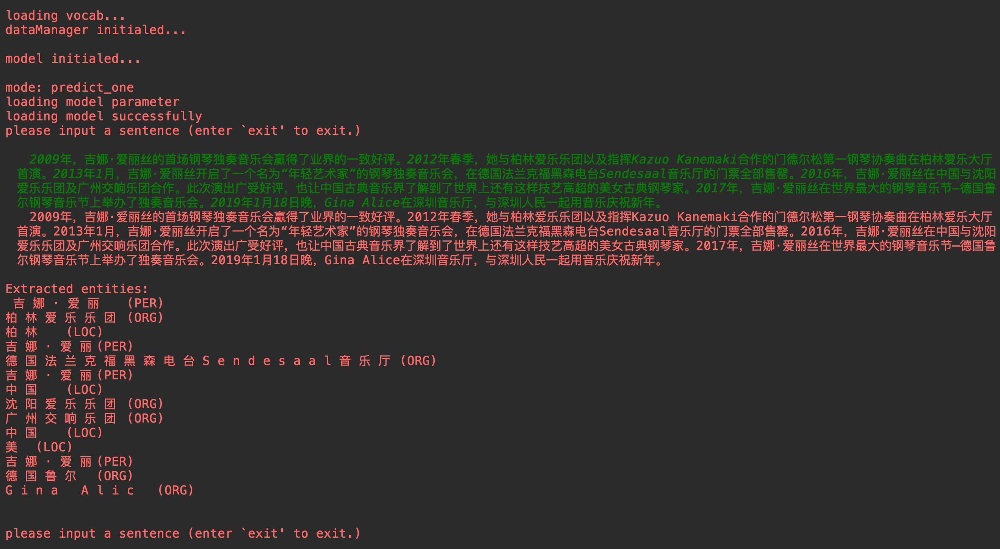
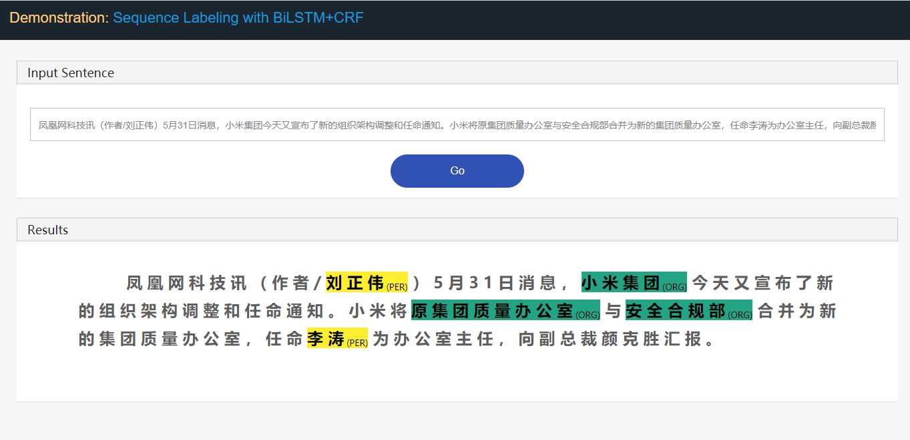
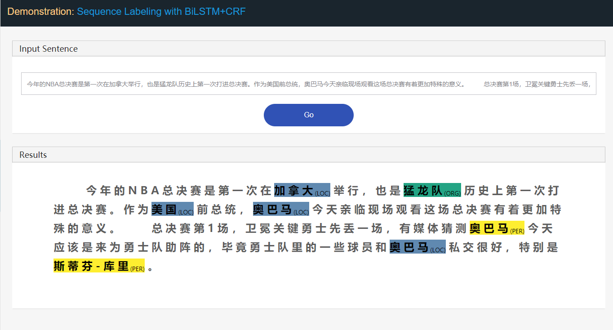
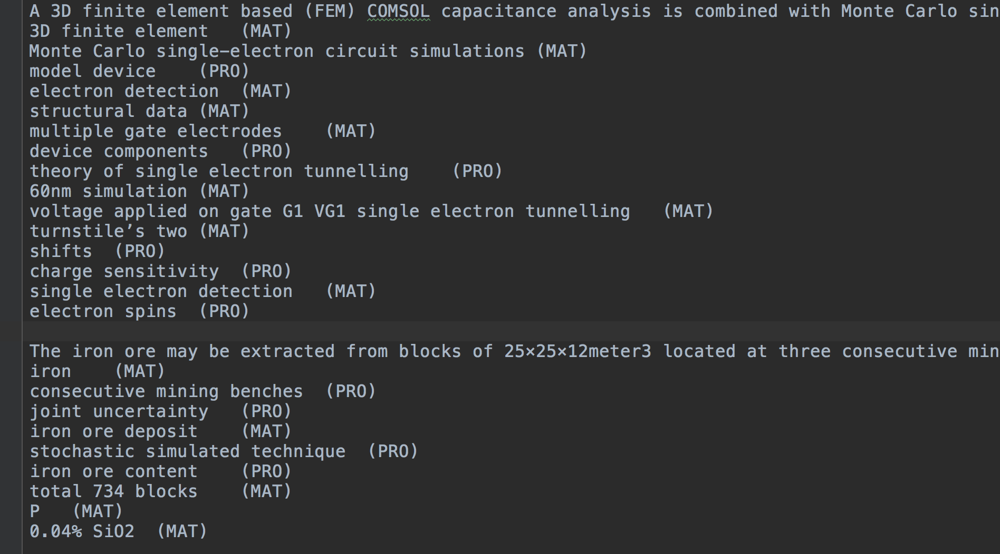

# BiLSTM+CRF for sequential labeling tasks

-blue.svg) 
 
 


---

🚀🚀🚀 A TensorFlow implementation of BiLSTM+CRF model, for sequence labeling tasks.

##### Project Features

* based on Tensorflow api. 
* highly _scalable_; everything is *configurable*. 
* modularized with clear structure.
* very friendly for beginners.
* easy to DIY.
 
---

## Task and Model

`Sequential labeling` is one typical methodology modeling the sequence prediction tasks in NLP.
 Common sequential labeling tasks include, e.g., 
 
 1. _Part-of-Speech (POS) Tagging_, 
 2. _Chunking_, 
 3. _Named Entity Recognition (NER)_, 
 4. _Punctuation Restoration_, 
 5. _Sentence Boundary Detection_, 
 6. _Scope Detection_,
 7. _Chinese Word Segmentation (CWG)_,
 8. _Semantic Role Labeling (SRL)_,
 9. _Spoken Language Understanding_ 
 10. and so forth...

Taking *Named Entity Recognition* (NER) task as example:
 
```bash
Stanford University located at California .
B-ORG    I-ORG      O       O  B-LOC      O
```
here, two entities, `Stanford University` and `California` are to be extracted.
And specifically, each `token` in the text is tagged with a corresponding `label`.
E.g., {`token`:_Stanford_, `label`:_B-ORG_}.
The sequence labeling model aims to predict the label sequence, given a token sequence.
  

`BiLSTM+CRF` proposed by [Lample et al., 2016](https://www.aclweb.org/anthology/N16-1030), is so far the most classical and stable neural model for sequential labeling tasks.



---

# Project


## Function Support

- configuring all settings
    - Running Mode: [`train`/`test`/`interactive_predict`/`api_service`]
    - Datasets(Input/Output): 
    - Labeling Scheme: 
        - [`BIO`/`BIESO`]
        - [`PER`|`LOC`|`ORG`]
        - ...
    - Model Configuration: 
        - encoder: BGU/Bi-LSTM, layer, Bi/Uni-directional
        - decoder: crf/softmax,
        - embedding level: char/word,
        - with/without self attention
        - hyperparameters,
        - ...
    - Training Settings: 
        - subscribe measuring metrics: [precision,recall,f1,accuracy]
        - optimazers: GD/Adagrad/AdaDelta/RMSprop/Adam
    - Testing Settings,
    - Api service Settings,
    
- logging everything
- web app demo for easy demonstration
- object oriented: BILSTM_CRF, Datasets, Configer, utils
- modularized with clear structure, easy for DIY.

see more in [HandBook](HandBook.md).

## Requirements

- python >=3.5 
- tensorflow 1.3
- numpy
- pandas
- Django
- jieba
- ...

## Setup

#### Option A:
download the repo for directly use.

```
git clone https://github.com/scofield7419/sequence-labeling-BiLSTM-CRF.git
pip install -r requirements.txt
```

#### Option B:
install the BiLSTM-CRF package as a module.

```
pip install BiLSTM-CRF
```

usage:
```
from BiLSTM-CRF.engines.BiLSTM_CRFs import BiLSTM_CRFs as BC
from BiLSTM-CRF.engines.DataManager import DataManager
from BiLSTM-CRF.engines.Configer import Configer
from BiLSTM-CRF.engines.utils import get_logger

...

config_file = r'/home/projects/system.config'
configs = Configer(config_file)

logger = get_logger(configs.log_dir)
configs.show_data_summary(logger) # optional

dataManager = DataManager(configs, logger)
model = BC(configs, logger, dataManager)
        
###### mode == 'train':
model.train()

###### mode == 'test':
model.test()

###### mode == 'single predicting':
sentence_tokens, entities, entities_type, entities_index = model.predict_single(sentence)
if configs.label_level == 1:
    print("\nExtracted entities:\n %s\n\n" % ("\n".join(entities)))
elif configs.label_level == 2:
    print("\nExtracted entities:\n %s\n\n" % ("\n".join([a + "\t(%s)" % b for a, b in zip(entities, entities_type)])))


###### mode == 'api service webapp':
cmd_new = r'cd demo_webapp; python manage.py runserver %s:%s' % (configs.ip, configs.port)
res = os.system(cmd_new)

open `ip:port` in your browser.

```

## Module Structure


```

├── main.py
├── system.config
├── HandBook.md
├── README.md
│
├── checkpoints
│   ├── BILSTM-CRFs-datasets1
│   │   ├── checkpoint
│   │   └── ...
│   └── ...
├── data
│   ├── example_datasets1
│   │   ├── logs
│   │   ├── vocabs
│   │   ├── test.csv
│   │   ├── train.csv
│   │   └── dev.csv
│   └── ...
├── demo_webapp
│   ├── demo_webapp
│   ├── interface
│   └── manage.py
├── engines
│   ├── BiLSTM_CRFs.py
│   ├── Configer.py
│   ├── DataManager.py
│   └── utils.py
└── tools
    ├── calcu_measure_testout.py
    └── statis.py
```

- Folds
    - in `engines` fold, providing the core functioning py.
    - in `data-subfold` fold, the datasets are placed.
    - in `checkpoints-subfold` fold, model checkpoints are stored.
    - in `demo_webapp` fold, we can demonstrate the system in web, and provides api.
    - in `tools` fold, providing some offline utils.
    
- Files
    - `main.py` is the entry python file for the system.
    - `system.config` is the configure file for all the system settings.
    - `HandBook.md` provides some usage instructions.
    - `BiLSTM_CRFs.py` is the main model.
    - `Configer.py` parses the `system.config`.
    - `DataManager.py` manages the datasets and scheduling.
    - `utils.py` provides on the fly tools.

    

## Quick Start

Under following steps:

#### step 1. composing your configure file in `system.config`.

- configure the Datasets(Input/Output).
- configure the Labeling Scheme.
- configure the Model architecture.
- configure the webapp setting when demonstrating demo.




#### step 2. starting training (necessary and compulsory)

- configure the running mode.
- configure the training setting.
- run `main.py`.




#### step 3. starting testing (optional)

- configure the running mode.
- configure the testing setting.
- run `main.py`.

    
#### step 4. starting interactively predicting (optional)

- configure the running mode.
- run `main.py`.
- interactively input sentences.
    


    
#### step 5. starting api service and web app (optional)

- configure the running mode.
- configure the api_service setting.
- run `main.py`.
- make interactively prediction in browser.
    





## Datasets

#### Input

Datasets including trainset, testset, devset are necessary for the overall usage.
However, is you only wanna train the model the use it offline, only the trainset
is needed. 
After training, you can make inference with the saved model checkpoint files.
If you wanna make test, you should 


For `trainset`, `testset`, `devset`, the common format is as follows:
Note that the `testset` can only exists with the the `Token` row. 

- word level:

```
(Token)         (Label)

for             O
the             O
lattice         B_TAS
QCD             I_TAS
computation     I_TAS
of              I_TAS
nucleon–nucleon I_TAS
low-energy      I_TAS
interactions    E_TAS
It              O
consists        O
in              O
simulating      B_PRO
...
```

- char level:

```
(Token) (Label)

马 B-LOC
来 I-LOC
西 I-LOC
亚 I-LOC
副 O
总 O
理 O
兼 O
财 B-ORG
政 I-ORG
部 I-ORG
长 O
...
```

Go to the example dataset for detailed formation.


#### Output (during testing phase)

During testing, model will output the predicted entities based on the `test.csv`.
The output files include two: `test.out`, `test.entity.out`(optional).

- `test.out`

    with the same formation as input `test.csv`.

- `test.entity.out`

```
Sentence
entity1 (Type)
entity2 (Type)
entity3 (Type)
...

```



## DIY

If you wanna adapt this project to your own specific sequence labeling task, you may need the following tips. 

- Download the repo sources.
- Labeling Scheme (most important)
    - label_scheme: BIO/BIESO
    - label_level: with/without suffix
    - hyphen, for connecting the prefix and suffix: `B_PER', `I_LOC'
    - suffix=[NR,NS,NT]
    - labeling_level: word/char

- Model: modify the model architecture into the one you wanted, in `BiLSTM_CRFs.py`.
     
- Dataset: adapt to your dataset, in the correct formation.

- Training
    - specify all directories.
    - training hyperparameters.
    

## Others

---

For more useage details, please refers to the [HandBook](HandBook.md)

You're welcomed to issue anything wrong.

---


Updating...
====
* 2019-Jun-04, Vex version, v1.0, supporting configuration, scalable.
* 2018-Nov-05, support char and word level embedding.
* 2017-Dec-06, init version, v0.1.


## License

[](https://creativecommons.org/publicdomain/zero/1.0/)